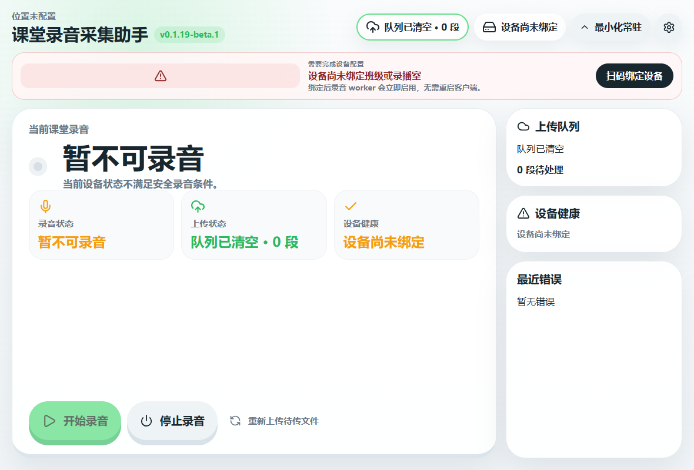
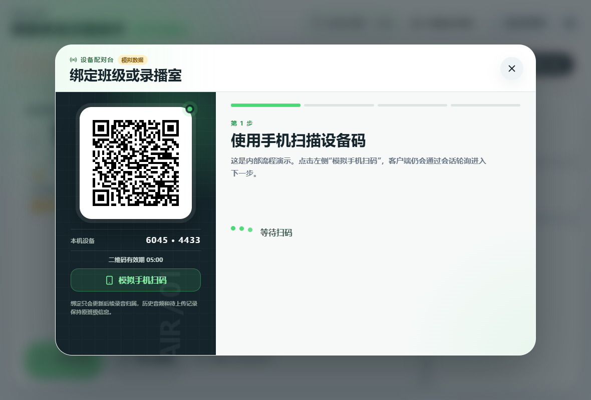
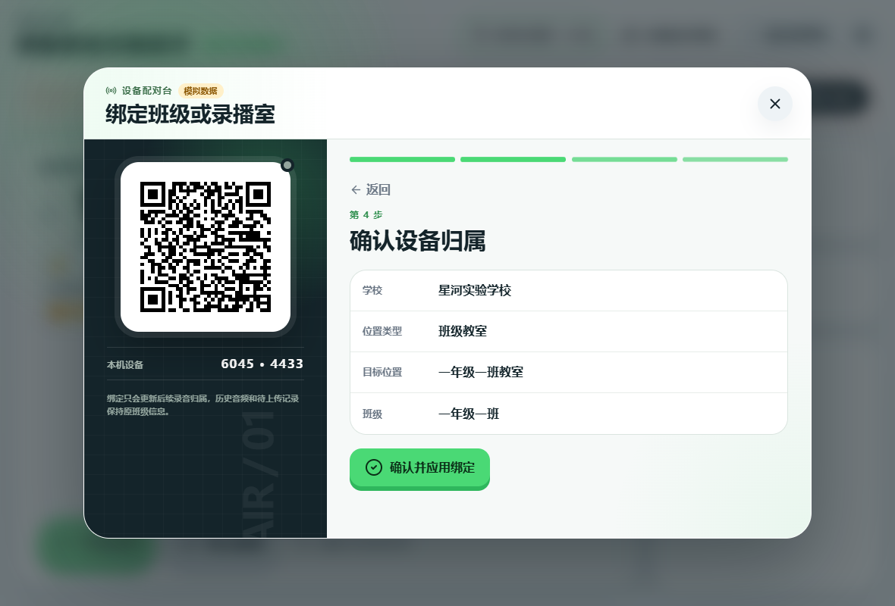
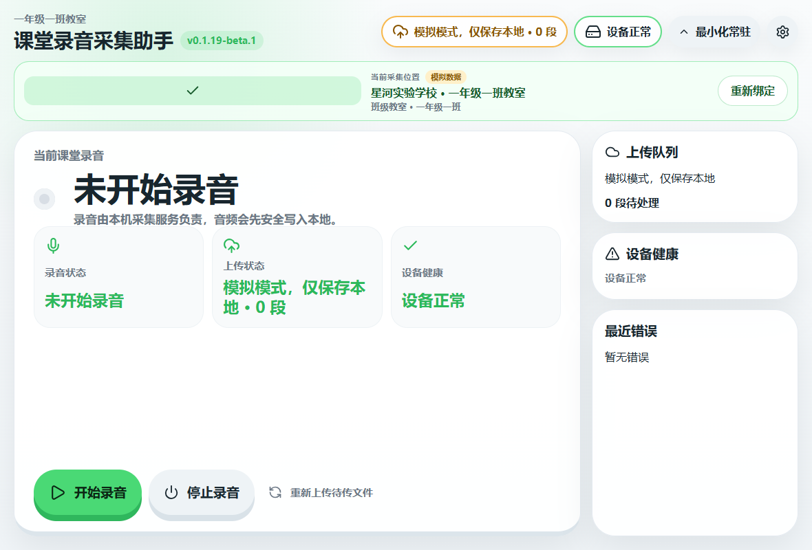
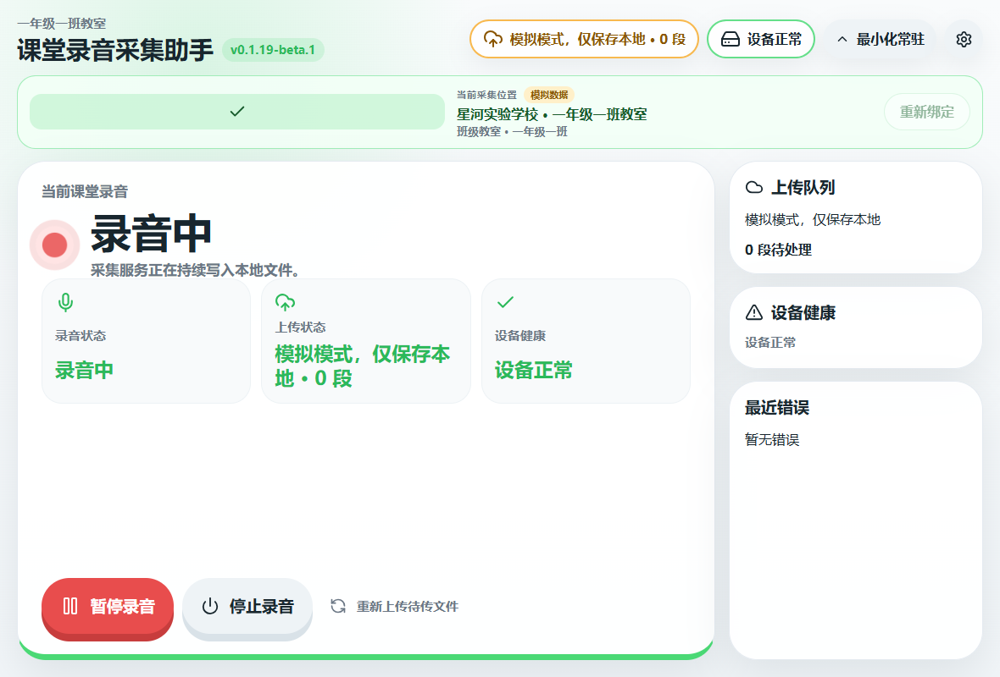
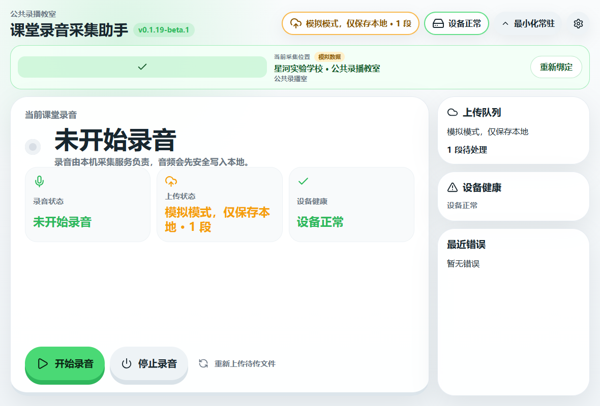

# WIN-REC 模拟扫码绑定与安装包录音证据（2026-07-15）

## 结论

本地 `0.1.19-beta.1` 新构建 Setup 已在 Windows 10 Pro x64 实际安装并通过以下流程：

1. 首次启动处于 `binding_required`，无法直接录音。
2. 显式 mock 模式展示二维码和模拟标识，完成学校、班级教室选择与确认。
3. 使用真实麦克风开始录音；录音期间重绑入口禁用。
4. 停止后生成有效 Ogg/Opus 文件，上传状态为 `mock_blocked`，队列只保留本地。
5. 空闲时重新绑定公共录播室，`classId`/`className` 正确清空。

这证明客户端流程和 adapter 边界可用，不代表正式服务端、小程序或生产上传已经联调完成。

## 最终安装包与环境

- Setup：`课堂录音采集助手-0.1.19-beta.1-Setup-x64.exe`
- Setup SHA-256：`339B9185892F083D12501C9CA1B21B1AB2B2E179F5FCB345CA2AD583BFAB001D`
- Portable SHA-256：`71B2588B71E52B62C98D1CA4B87328B34BAD76D35F330EEAB5BAB04C77B7C747`
- 安装目录：`E:\WIN-REC-BINDING-E2E-INSTALLED-20260715`
- 独立数据目录：`E:\WIN-REC-BINDING-E2E-20260715-03\data`
- 模式：显式 `BINDING_SERVICE_MODE=mock`
- 正常启动门禁：真实安装 exe 启动成功，worker endpoint/token 鉴权成功，初始状态 `binding_required`，worker `MainWindowHandle=0`

## 录音与队列证据

- 音频：`6045CB624433_20260715_042745_161263.ogg`
- 大小：15,923 字节
- SHA-256：`BB979E9760DEDA16230032335E92DFA3C16DA6A80F7491D2281A52ABF243B3E7`
- 队列：`status=pending`、`attempts=0`、`metadata_attempts=0`、`uploaded_url` 为空
- 录音归属：`school_id=1001`、`location_id=room-101`
- 重绑后位置：`studio-main`，且 `classId`/`className` 为空

录音条目保留开始录音时的教室归属，没有被之后的演播室重绑篡改。

## 截图

机器可读快照见 `WIN-REC-BINDING-MOCK-2026-07-15-assets-installed/result.json`。

## 首次验证意外上传与修复

首次内部验证使用 `E:\WIN-REC-BINDING-E2E-20260715-01`。mock 绑定激活后沿用了生产上传服务，导致 15,896 字节的测试录音被上传并登记，队列在 `2026-07-15 03:53:20 UTC` 变为 `completed`。本地音频 SHA-256 为 `66B626D5FFACA3675C02E25DA45137FBCC081591E973E9F33D890795F34572FC`。

发现后立即停止相关应用和 worker；没有尝试删除或修改远端记录，避免扩大外部状态变更。随后修复为：只要 `binding_source=mock`，worker 就不创建生产上传服务、不启动上传线程，并显示“模拟模式，仅保存本地”。修复后的解包包和实际安装包分别使用全新目录复测，队列都保持 `pending` 且尝试计数为 0。

首次运行截图/快照保留在 `WIN-REC-BINDING-MOCK-2026-07-15-assets`，修复后的解包验证保留在 `WIN-REC-BINDING-MOCK-2026-07-15-assets-safe`。这些记录不得被解释为一次受控的生产上传验收。

## 正式接口待办

- 服务端提供扫码会话、登录鉴权、学校与位置目录、确认绑定接口及错误码约定。
- 小程序完成扫码登录和权限确认。
- 在客户端 `binding-service.js` adapter 内接入 HTTP，保留现有 controller/UI/worker 协议。
- 使用非 mock 配置验证会话过期、权限隔离、幂等确认、断网恢复和真实上传；生产模式不得自动回退 mock。
