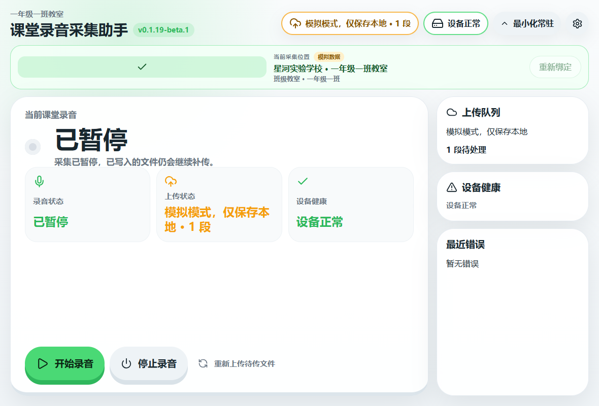

# 暂停录音不弹控制台验证（2026-07-15）

## 原始现象与根因

Windows 客户端暂停录音时会结束当前采集 session，并立即调用 packaged `ffmpeg.exe` 把 WAV 分段编码为 Ogg/Opus。编码器原先使用默认 `subprocess.run` 创建标志；标准控制台版 FFmpeg 因此短暂分配 CMD 窗口，编码结束后窗口自行关闭。

worker 中没有发现第二个暂停辅助进程。修复是在统一 FFmpeg 启动边界为 Windows 显式设置 `subprocess.CREATE_NO_WINDOW`，不改变编码、错误回退或队列行为。

## 自动化与真实包验证

- 回归测试：`python -m pytest worker\test_segment_encoder.py -q`，修复前因缺少 `creationflags` 稳定失败，修复后 4 项通过。
- worker 全量测试：149 项通过，1 项跳过。
- 新 worker：Python 3.11.9、PyInstaller 6.21.0，使用 windowed bootloader 重新构建。
- 新 `win-unpacked`：真实 mock 绑定、真实麦克风开始录音并点击“暂停”。
- 高频进程采样：检测到 packaged FFmpeg 进程 1 个；20 ms 采样周期内 `visibleWindowCount=0`。
- 状态结果：成功进入 `paused`，随后停止并形成 1 段本地待传音频；mock 上传仍保持阻断。

机器可读的最终状态见 `WIN-REC-PAUSE-NO-CONSOLE-2026-07-15-assets/result.json`。
